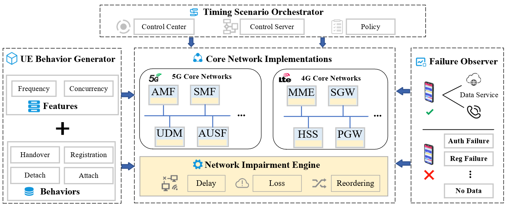

# Chronos: Lightweight Testing Framework for Timing-Induced Interaction Failures in LTE and 5G Core Networks

## Overview

This repository provides an anonymized artifact for **Chronos**: Lightweight Testing Framework for Timing-Induced Interaction Failures in LTE and 5G Core Networks.

Chronos focuses on failures caused by timing-induced interaction anomalies between concurrent control-plane procedures under
different execution timings.  
The framework operates in a black-box manner and uses only protocol-compliant UE behaviors.

The artifact is implemented using a lightweight **agent–server–center** architecture.

---

## Architecture

Chronos consists of three logical components:

Network_impairment_Engine
- **engine**  
  Execution node that runs NF instances, applies timing perturbation.

Timing_Scenario_Orchestrator
- **control_center**  
  Global experiment controller and scheduler.

- **control_server**  
  Scenario coordinator that dispatches timing scenarios and UE behaviors.

UE_Behavior_Generator
- **5gregpdu-master** 
  A self-developed 5G UE emulator designed for interacting with commercial 5G core networks.
- **eNB_com-master** 
  A customized LTE UE/eNB emulator derived from the open-source eNB project(https://github.com/fasferraz/eNB/tree/main), designed for commercial 4G core networks.
- **eNB_open5gs**
  A customized LTE UE/eNB emulator derived from the same open-source eNB project(https://github.com/fasferraz/eNB/tree/main), designed for Open5GS.
- **UERANSIM** 
  https://github.com/aligungr/UERANSIM

Failure Observer

We use commercial smartphones together with a base station built on the srsRAN platform to access the target core network, and determine whether the core network fails by observing the runtime behavior of the smartphones. In addition, we also infer failures from the access results generated by the UE_Behavior_Generator.

No modification to cellular core network implementations is required.

---

## Requirements

- Linux
- Docker / Docker Compose
- Python ≥ 3.8
- A running 4G or 5G cellular core network (not included)

---

## Quick Start

1. Network_impairment_Engine deployment:
For deployment instructions of the Network_Impairment_Engine, please refer to the README in the `engine` directory of the Network_Impairment_Engine package:
[Network_Impairment_Engine/engine/README.md](Network_Impairment_Engine/engine/README.md).
2. Timing_Scenario_Orchestrator deployment:
The Timing_Scenario_Orchestrator consists of two main components: the control center and the control server.
The control center is deployed on a Windows host. It uses the configuration templates in the `config` directory to define and globally control timing perturbation scenarios.
The control server is deployed on the Docker host machine. Its deployment procedure follows the instructions provided in the README of the `control_server` module ([Timing_Scenario_Orchestrator/control_server/README.md](Timing_Scenario_Orchestrator/control_server/README.md)).
3. UE_Behavior_Generator deployment:
The UE_Behavior_Generator includes four UE behavior generators: a UE behavior generator for commercial 5G core networks, a UE behavior generator for commercial 4G core networks, a UE behavior generator for the Open5GS 4G core network, and UERANSIM.
All configuration templates and UE behavior settings for these generators are defined in `ue.py`.
4. Failure Observer deployment:
The Failure Observer is deployed using a commercial off-the-shelf UE together with a base station built on the srsRAN platform.  
In our setup, the smartphone model is **Xiaomi Mi 10**, and the srsRAN platform is available at:https://www.srsran.com/5g

## Future Work and Planned Extensions

At this stage, we only release the core components that are directly related to the paper. We plan to extend this artifact in the following directions.

1. Curated failure cases.
We will provide a collection of representative failure cases to help users quickly understand the usage of Chronos and facilitate further research on timing-induced interaction failures.

2. Cascading effects under large-scale deployments.
We plan to release scenarios, as discussed in the Discussion section of the paper, to study the cascading impact of timing-induced interaction failures under large-scale deployments.